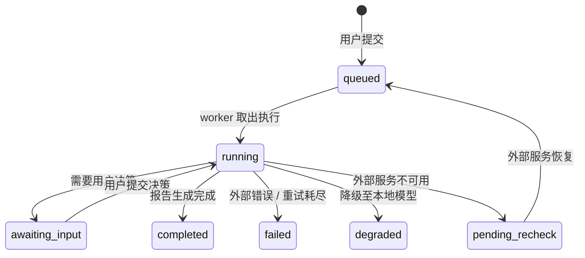
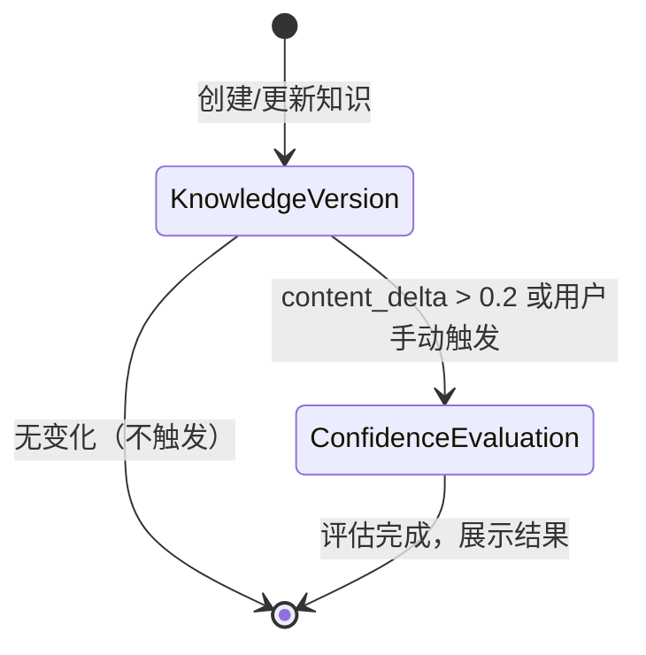

# Data Model: AI 知识管理助手

> 生成日期: 2026-04-05 | 关联 Spec: [spec.md](./spec.md) | 关联 Plan: [plan.md](./plan.md) | 关联 Research: [research.md](./research.md)

---

## 1. 实体关系图 (ER Diagram)

```text
+---------------+       +------------------+       +------------------+
|  KnowledgeItem|1----* | KnowledgeVersion |1----* |ConfidenceEvaluation|
+---------------+       +------------------+       +------------------+
       | 1
       |
       | *
+----------------+
|  Attachment    |
+----------------+
       | 1
       |
       | *
+----------------+
|  TagLink       |
+----------------+
       | *
       |
       | 1
+----------------+
|  Tag           |
+----------------+

+----------------+       +------------------+       +------------------+
|  Conversation  |1----* |  Message         |       |  MessageCitation |
+----------------+       +------------------+       +------------------+
                                                              | *
                                                              |
                                                              | 1
+----------------+                                     +---------------+
|  UserProfile   |                                     | KnowledgeItem |
+----------------+                                     +---------------+

+----------------+       +------------------+       +------------------+
|  ResearchTask  |1----* | ResearchSection  |       | ResearchCitation |
+----------------+       +------------------+       +------------------+
```

---

## 2. 实体定义

### 2.1 KnowledgeItem（知识条目）

用户知识库中的单个内容单元。

| 字段 | 类型 | 约束 | 说明 |
|------|------|------|------|
| `id` | UUID | PK | 唯一标识 |
| `title` | TEXT | NOT NULL | 标题（可自动生成或用户编辑） |
| `source_type` | TEXT | NOT NULL | 来源类型：`text` / `file` / `url` |
| `current_version_id` | UUID | FK → KnowledgeVersion.id, nullable | 当前有效版本 |
| `is_deleted` | BOOLEAN | DEFAULT FALSE | 软删除标记 |
| `created_at` | DATETIME | NOT NULL | 创建时间 |
| `updated_at` | DATETIME | NOT NULL | 最后更新时间 |

**关系**:
- 一对多 → `KnowledgeVersion`（历史版本）
- 一对多 → `Attachment`（原始媒体文件）
- 多对多 → `Tag`（通过 `TagLink` 关联）

---

### 2.2 KnowledgeVersion（知识版本）

知识条目的某个具体版本。每次内容显著修改（>20% 差异）或用户手动触发时生成新版本。

| 字段 | 类型 | 约束 | 说明 |
|------|------|------|------|
| `id` | UUID | PK | 唯一标识 |
| `item_id` | UUID | FK → KnowledgeItem.id | 所属知识条目 |
| `content_text` | TEXT | NOT NULL | 纯文本内容（已提取/转录后的可搜索文本） |
| `content_delta` | REAL | DEFAULT 0.0 | 与上一版本的内容差异比例（0.0-1.0） |
| `created_by` | TEXT | NOT NULL | 创建来源：`user_edit` / `auto_extraction` / `import` / `research_report` |
| `created_at` | DATETIME | NOT NULL | 版本创建时间 |

**关系**:
- 属于 → `KnowledgeItem`
- 一对一 ← `ConfidenceEvaluation`（每个版本有独立的置信度评估）
- 一对多 ← `EmbeddingChunk`（向量分片，为了检索）

**状态转换**:
```
[创建新版本] → 异步触发 ConfidenceEvaluation → 完成评估后展示评分
```

---

### 2.3 Attachment（原始媒体文件）

知识条目的原始媒体附件，存储于本地加密文件系统。

| 字段 | 类型 | 约束 | 说明 |
|------|------|------|------|
| `id` | UUID | PK | 唯一标识 |
| `item_id` | UUID | FK → KnowledgeItem.id | 所属知识条目 |
| `filename` | TEXT | NOT NULL | 原始文件名 |
| `mime_type` | TEXT | NOT NULL | MIME 类型 |
| `storage_path` | TEXT | NOT NULL | 本地存储相对路径，如 `files/AB/CD/<item-id>/original.jpg.enc` |
| `size_bytes` | INTEGER | NOT NULL | 文件大小 |
| `extraction_status` | TEXT | NOT NULL | 提取状态：`success` / `failed` / `pending` / `not_applicable` |
| `extraction_error` | TEXT | nullable | 提取失败时的简要错误信息 |
| `created_at` | DATETIME | NOT NULL | 上传时间 |

**约束**:
- 单文件大小 ≤ 1GB（在应用层校验）。

---

### 2.4 Tag（标签）

知识分类标签。

| 字段 | 类型 | 约束 | 说明 |
|------|------|------|------|
| `id` | UUID | PK | 唯一标识 |
| `name` | TEXT | UNIQUE, NOT NULL | 标签名称 |
| `color` | TEXT | nullable | 可选展示颜色 |
| `created_at` | DATETIME | NOT NULL | 创建时间 |

**关系**:
- 多对多 → `KnowledgeItem`（通过 `TagLink`）

---

### 2.5 TagLink（标签关联）

知识条目与标签的多对多关联表。

| 字段 | 类型 | 约束 | 说明 |
|------|------|------|------|
| `item_id` | UUID | FK → KnowledgeItem.id, PK | |
| `tag_id` | UUID | FK → Tag.id, PK | |

---

### 2.6 EmbeddingChunk（嵌入向量分片）

用于 RAG 检索的文本分片及其向量表示。

| 字段 | 类型 | 约束 | 说明 |
|------|------|------|------|
| `id` | UUID | PK | 唯一标识 |
| `version_id` | UUID | FK → KnowledgeVersion.id | 所属知识版本 |
| `chunk_text` | TEXT | NOT NULL | 分片文本 |
| `embedding` | F32_BLOB | NOT NULL | sqlite-vec 向量（维度由模型决定，如 1536 或 384） |
| `chunk_index` | INTEGER | NOT NULL | 分片在该版本中的顺序索引 |

**说明**:
- 存储于 sqlite-vec 虚拟表 `vec_chunks` 中，与 SQLite 普通表通过 `id` 关联。
- 当版本被删除或重新生成时，需同步清理对应向量。

---

### 2.7 ConfidenceEvaluation（置信度评估）

针对单个 KnowledgeVersion 的评估结果。

| 字段 | 类型 | 约束 | 说明 |
|------|------|------|------|
| `id` | UUID | PK | 唯一标识 |
| `version_id` | UUID | FK → KnowledgeVersion.id, UNIQUE | 评估的目标版本（一对一） |
| `score_level` | TEXT | NOT NULL | 等级：`high` / `medium` / `low` |
| `score_value` | REAL | nullable | 原始评分（如 0.0-1.0，可选） |
| `method` | TEXT | NOT NULL | 评估方法：`web_verification` / `commonsense_reasoning` / `hybrid` |
| `rationale` | TEXT | NOT NULL | 评估依据的简要说明 |
| `evaluated_at` | DATETIME | NOT NULL | 评估时间 |

**业务规则**:
- 每次生成新版本时，若 `content_delta` > 0.2 则自动创建新的 `ConfidenceEvaluation` 记录。
- 用户可以手动触发重新评估（即使 `content_delta` ≤ 0.2）。
- 旧版本的评估记录永不覆盖。

---

### 2.8 Conversation（对话会话）

用户与系统的问答会话。

| 字段 | 类型 | 约束 | 说明 |
|------|------|------|------|
| `id` | UUID | PK | 唯一标识 |
| `title` | TEXT | NOT NULL | 会话标题（首条消息摘要或用户编辑） |
| `created_at` | DATETIME | NOT NULL | 创建时间 |
| `updated_at` | DATETIME | NOT NULL | 最后消息时间 |

**关系**:
- 一对多 → `Message`

---

### 2.9 Message（对话消息）

会话中的单条消息。

| 字段 | 类型 | 约束 | 说明 |
|------|------|------|------|
| `id` | UUID | PK | 唯一标识 |
| `conversation_id` | UUID | FK → Conversation.id | 所属会话 |
| `role` | TEXT | NOT NULL | 角色：`user` / `assistant` / `system` |
| `content` | TEXT | NOT NULL | 消息内容 |
| `created_at` | DATETIME | NOT NULL | 发送时间 |

**关系**:
- 一对多 → `MessageCitation`（助手消息引用的知识来源）

---

### 2.10 MessageCitation（消息引用）

助手回答中引用的知识来源。

| 字段 | 类型 | 约束 | 说明 |
|------|------|------|------|
| `id` | UUID | PK | 唯一标识 |
| `message_id` | UUID | FK → Message.id | 所属消息 |
| `item_id` | UUID | FK → KnowledgeItem.id | 引用的知识条目 |
| `version_id` | UUID | FK → KnowledgeVersion.id, nullable | 引用的具体版本 |
| `chunk_text` | TEXT | nullable | 被引用的原始分片文本（快照） |
| `citation_index` | INTEGER | NOT NULL | 引用序号（如 [1]、[2]） |

---

### 2.11 UserProfile（用户画像）

基于对话历史推导的用户偏好与知识水平。

| 字段 | 类型 | 约束 | 说明 |
|------|------|------|------|
| `id` | INTEGER | PK | 固定为 1（单用户应用） |
| `interests` | JSON | nullable | 领域偏好列表（如 `["低空经济", "人工智能"]`） |
| `knowledge_levels` | JSON | nullable | 各领域知识水平（如 `{"人工智能": "advanced"}`） |
| `last_updated` | DATETIME | NOT NULL | 最后更新时间 |

**说明**:
- 每隔一定对话轮次或显式触发时，由 LLM 分析最近对话并更新此表。
- 在生成调研报告和回答时，将 `interests` 和 `knowledge_levels` 作为系统提示词上下文注入。

---

### 2.12 ResearchTask（调研任务）

用户提交的异步调研任务。

| 字段 | 类型 | 约束 | 说明 |
|------|------|------|------|
| `id` | UUID | PK | 唯一标识 |
| `topic` | TEXT | NOT NULL | 调研主题 |
| `scope_description` | TEXT | nullable | 范围描述 |
| `status` | TEXT | NOT NULL | 状态：`queued` / `running` / `awaiting_input` / `completed` / `failed` / `degraded` / `pending_recheck` |
| `progress_percent` | INTEGER | DEFAULT 0 | 进度百分比（0-100） |
| `search_source_used` | TEXT | nullable | 实际使用的搜索源：`llm_builtin` / `search_api` / `http_crawler` / `local_llm` |
| `created_at` | DATETIME | NOT NULL | 创建时间 |
| `started_at` | DATETIME | nullable | 开始执行时间 |
| `completed_at` | DATETIME | nullable | 完成时间 |
| `error_message` | TEXT | nullable | 失败时的错误信息 |
| `saved_item_id` | UUID | FK → KnowledgeItem.id, nullable | 若用户选择保存到知识库，关联的知识条目 |

**状态转换**:
```
queued → running → (awaiting_input → running)* → completed
        ↑                |
        |                v
   pending_recheck    failed / degraded
```

---

### 2.13 ResearchSection（调研报告章节）

调研报告的结构化内容章节。

| 字段 | 类型 | 约束 | 说明 |
|------|------|------|------|
| `id` | UUID | PK | 唯一标识 |
| `task_id` | UUID | FK → ResearchTask.id | 所属调研任务 |
| `section_type` | TEXT | NOT NULL | 章节类型：`background` / `key_points` / `trends` / `conclusion` / `summary` |
| `title` | TEXT | NOT NULL | 章节标题 |
| `content` | TEXT | NOT NULL | 章节正文（Markdown） |
| `order_index` | INTEGER | NOT NULL | 章节顺序 |
| `created_at` | DATETIME | NOT NULL | 生成时间 |

---

### 2.14 ResearchCitation（调研引用）

调研报告中引用的外部来源。

| 字段 | 类型 | 约束 | 说明 |
|------|------|------|------|
| `id` | UUID | PK | 唯一标识 |
| `task_id` | UUID | FK → ResearchTask.id | 所属调研任务 |
| `source_title` | TEXT | nullable | 来源标题 |
| `source_url` | TEXT | nullable | 来源链接 |
| `source_summary` | TEXT | nullable | 来源摘要 |

---

### 2.15 SystemConfig（系统配置）

用户可配置的系统级参数和隐私策略。

| 字段 | 类型 | 约束 | 说明 |
|------|------|------|------|
| `id` | INTEGER | PK | 固定为 1 |
| `llm_config` | JSON | NOT NULL | LLM 端点配置（base_url, api_key, model 等） |
| `embedding_config` | JSON | NOT NULL | Embedding 端点配置 |
| `search_config` | JSON | nullable | 独立搜索 API 配置 |
| `privacy_settings` | JSON | NOT NULL | 隐私开关：`allow_full_content`, `allow_web_search`, `allow_log_upload` |
| `retry_settings` | JSON | NOT NULL | 重试配置：`retry_times` (默认 3), `timeout_seconds` |
| `storage_settings` | JSON | NOT NULL | 存储配置：`archive_threshold_gb`（归档压缩阈值）, `version_retention_policy` |
| `log_settings` | JSON | NOT NULL | 日志配置：`retention_days`, `level` |
| `updated_at` | DATETIME | NOT NULL | 最后更新时间 |

---

## 3. 验证规则汇总

| 规则 ID | 描述 | 校验位置 |
|---------|------|----------|
| `VAL-001` | 知识纯文本内容长度必须 ≥ 5 个字符 | API 层 + 服务层 |
| `VAL-002` | 单文件附件大小必须 ≤ 1GB | API 层（流式校验） |
| `VAL-003` | 标签名称不能为空且不能重复 | 数据库 UNIQUE + API 层 |
| `VAL-004` | 用户密码必须满足最小强度要求（至少 8 位，含字母和数字） | 初始化 / 修改密码 API |
| `VAL-005` | 调研任务主题不能为空 | API 层 |
| `VAL-006` | `progress_percent` 必须在 0-100 之间 | 数据库 CHECK 约束或应用层 |

---

## 4. 数据库索引设计

| 表/字段 | 索引类型 | 目的 |
|---------|----------|------|
| `KnowledgeItem.is_deleted` | B-tree | 过滤已删除条目 |
| `KnowledgeItem.updated_at` | B-tree | 列表按时间排序 |
| `KnowledgeVersion.item_id` | B-tree | 快速查询某条目的所有版本 |
| `Message.conversation_id` | B-tree | 快速加载会话消息 |
| `ResearchTask.status` | B-tree | 快速查询待处理和运行中任务 |
| `Tag.name` | UNIQUE | 标签去重 |
| `EmbeddingChunk` | sqlite-vec 虚拟表 | 向量相似度检索 |
| `EmbeddingChunk.chunk_text` | FTS5 虚拟表 | 全文关键词检索 |

---

## 5. 关键状态机

### 5.1 调研任务状态机



### 5.2 知识版本与置信度评估生命周期


