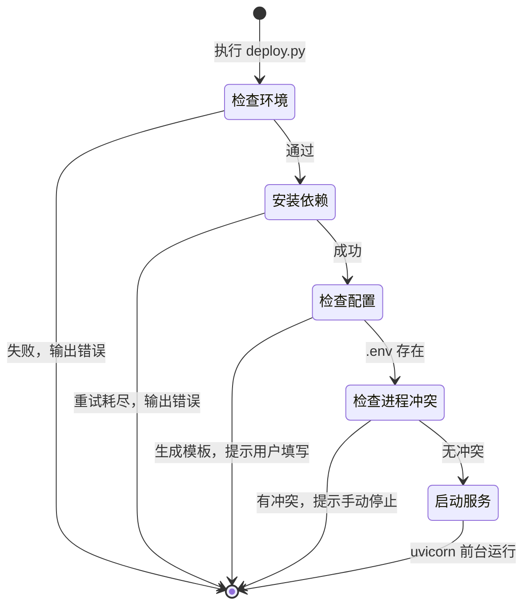
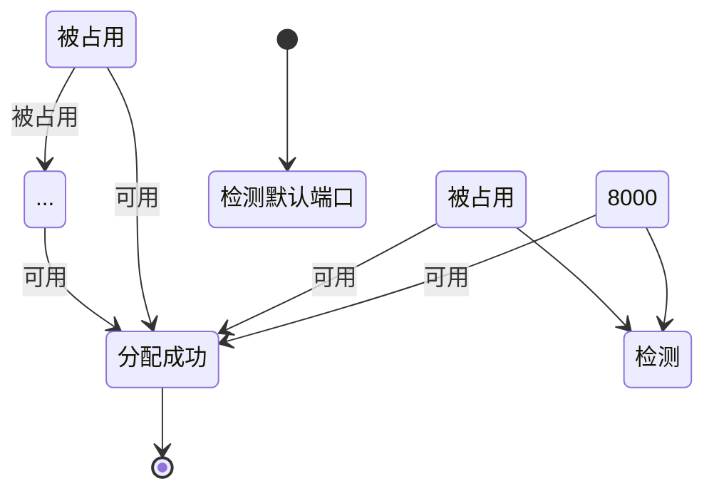

# Data Model: 一键部署功能

> 生成日期: 2026-04-07 | 关联 Spec: [spec.md](./spec.md) | 关联 Plan: [plan.md](./plan.md) | 关联 Research: [research.md](./research.md)

---

## 1. 实体关系图

```text
+------------------+
| DeploymentConfig |
+------------------+
| DeploymentStep   |
+------------------+
| DeploymentLog    |
+------------------+
```

*说明*: 本功能为 CLI 部署脚本，不涉及持久化业务数据库表。以下实体用于描述脚本运行时的内存状态、生成的配置文件以及输出日志的结构化契约。

---

## 2. 实体定义

### 2.1 DeploymentConfig（部署运行时配置）

脚本在执行过程中解析和使用的配置集合。

| 字段 | 类型 | 约束 | 说明 |
|------|------|------|------|
| `project_root` | Path | NOT NULL | 项目根目录（`deploy.py` 所在目录） |
| `python_executable` | str | NOT NULL | 当前使用的 Python 解释器路径（`sys.executable`） |
| `pip_command` | list[str] | NOT NULL | pip 调用命令，通常为 `[sys.executable, "-m", "pip"]` |
| `target_port` | int | DEFAULT 8000 | 服务默认监听端口 |
| `actual_port` | int | nullable | 经检测后确定的可用的实际端口 |
| `requirements_file` | Path | DEFAULT `project_root / "requirements.txt"` | 依赖清单文件路径 |
| `env_file` | Path | DEFAULT `project_root / ".env"` | 环境配置文件路径 |
| `data_dir` | Path | DEFAULT `project_root / "data"` | 数据库文件所在目录 |
| `log_dir` | Path | DEFAULT `project_root / "logs"` | 日志输出目录 |
| `max_retries` | int | DEFAULT 3 | 依赖安装失败时的最大重试次数 |
| `retry_delay_seconds` | int | DEFAULT 2 | 每次重试间隔秒数 |

---

### 2.2 DeploymentStep（部署步骤状态）

脚本执行流程中的单个步骤及其运行时状态。

| 字段 | 类型 | 约束 | 说明 |
|------|------|------|------|
| `step_number` | int | NOT NULL | 步骤序号（如 1, 2, 3...） |
| `name` | str | NOT NULL | 步骤名称，如 `检查环境`、`安装依赖`、`检查配置` |
| `status` | str | NOT NULL | 状态：`pending` / `running` / `ok` / `fail` / `skip` |
| `message` | str | nullable | 步骤完成或失败时的附加说明 |
| `started_at` | datetime | nullable | 步骤开始时间 |
| `completed_at` | datetime | nullable | 步骤结束时间 |

**状态转换**:
```
pending → running → ok
              ↓
            fail / skip
```

---

### 2.3 DeploymentLog（部署日志输出）

终端输出给用户的日志记录结构。

| 字段 | 类型 | 约束 | 说明 |
|------|------|------|------|
| `timestamp` | datetime | NOT NULL | 日志产生时间 |
| `level` | str | NOT NULL | 级别：`info` / `warning` / `error` / `success` |
| `message` | str | NOT NULL | 日志正文 |

---

## 3. 验证规则汇总

| 规则 ID | 描述 | 校验位置 |
|---------|------|----------|
| `VAL-DEP-001` | Python 版本必须 ≥ 3.11 | 部署脚本 `check_prerequisites()` |
| `VAL-DEP-002` | `pip` 命令必须可执行 | 部署脚本 `check_prerequisites()` |
| `VAL-DEP-003` | 目标端口必须在 1024–65535 之间 | 部署脚本端口探测逻辑 |
| `VAL-DEP-004` | `.env` 文件缺失时必须生成完整模板 | 部署脚本 `ensure_env_file()` |
| `VAL-DEP-005` | 重试次数必须 ≥ 0 | 部署脚本安装逻辑 |

---

## 4. 关键状态机

### 4.1 部署脚本整体执行流程



### 4.2 端口分配策略


